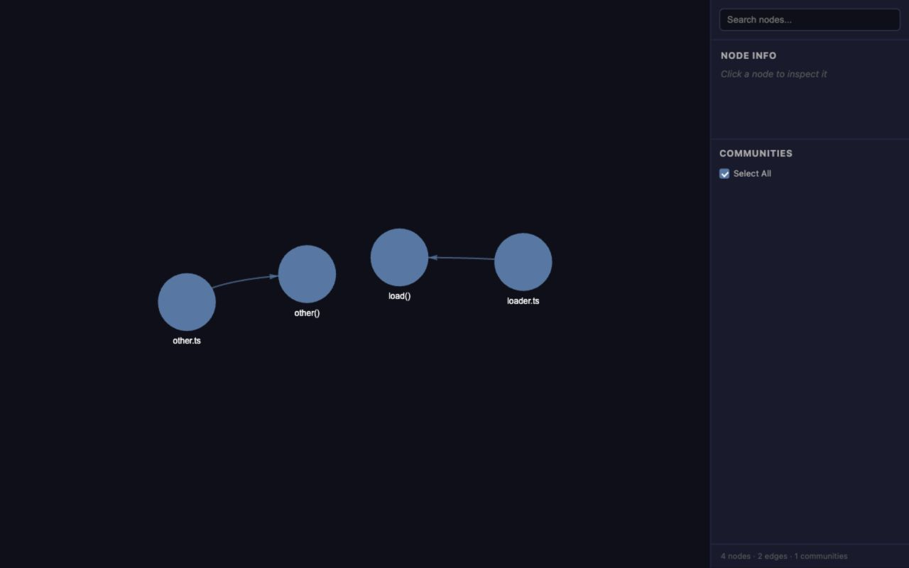
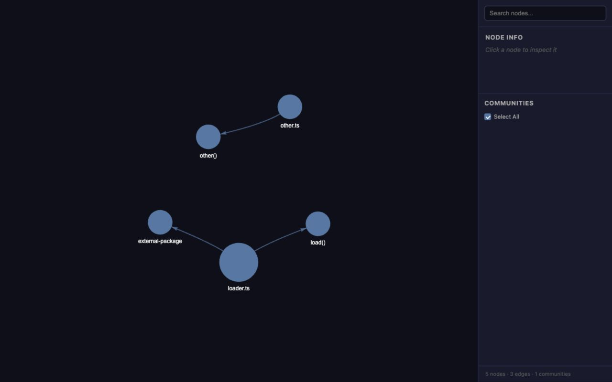

# Incremental external-import reproduction

These screenshots show Graphify's built-in HTML viewer after two CLI extractions of an unchanged two-file corpus.
The viewer was rendered from the second run's saved raw graph using Graphify's `build_from_json` and `to_html` functions.
The screenshots were captured in a browser at 1280 x 800; no image editing was applied.
Graph layout positions are generated by the viewer.

Before: `33362d969292b57eda82f3fbd9eb5f3f5bc9bbc2`.
After: `7818da95b5db095bdf87d55b6418015c6d6e2dcc`.
Environment: Python 3.13.11, macOS arm64, repository-pinned dependencies.
All input is the synthetic fixture below; no private project content is included.

`corpus/loader.ts`:

```ts
export async function load() { return import('external-package'); }
```

`corpus/other.ts`:

```ts
export function other() { return 1; }
```

Run twice with the same output directory, starting with no prior output:

```sh
python -m graphify extract corpus --code-only --no-cluster --max-workers 1 --out result
```

The baseline raw graph falls from 5 nodes / 4 edges to 4 nodes / 3 edges.
The patched graph remains at 5 nodes / 4 edges.
The viewer uses normal graph assembly, which drops an unresolved `ref_` edge, so its totals are respectively 4 nodes / 2 edges and 5 nodes / 3 edges.
The visible difference is the `external-package` node and its connection to `loader.ts`.

Receipts contain CLI output with temporary workspace paths replaced by `<workspace>`.
JSON files contain the second run's actual saved graphs.
Existing graphs built before the fix require one `extract ... --force` rebuild to replace their old source metadata.




